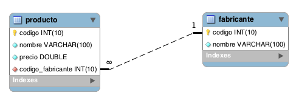

# Tienda - Funciones

## Ejercicios

1. Obtener el precio promedio de los productos de un fabricante.
2. Calcular el precio total de todos los productos de un fabricante.
3. Obtener el nombre del producto más caro.
4. Contar la cantidad de productos disponibles de un fabricante.
5. Obtener el precio mínimo de los productos de un fabricante.
